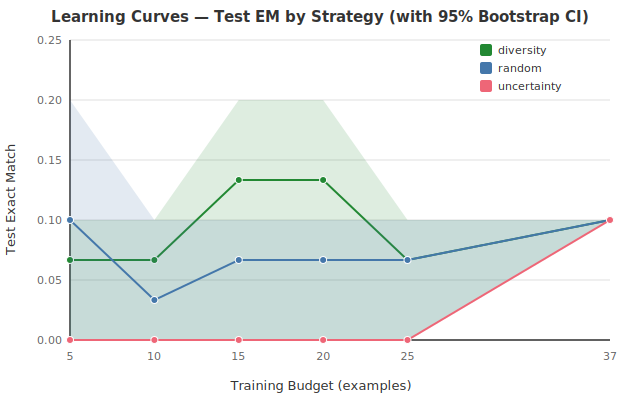

# AXIOM-Mobile

## Minimal Data for On-Device Domain Reasoning

Annie Boltwood, Mahim Chaudhary, Ariel Tyson

Simon Fraser University -- CMPT 416

---

## Problem / Motivation

- Mobile devices are the primary computing platform for most users
- Domain-specific reasoning (e.g., answering questions about UI screenshots) requires training data
- Mobile deployment imposes hard constraints: latency, energy, memory, model size
- Core tension: high quality demands large datasets, but deployment demands small, fast models

---

## Research Question

**What is k* -- the minimal training set size for effective on-device domain reasoning?**

"Effective" is defined jointly across all six thresholds:

| Metric | Threshold |
|--------|-----------|
| Exact Match (EM) | >= 70% |
| Latency p50 | <= 400 ms |
| Latency p95 | <= 600 ms |
| Energy | < 5% battery / hr |
| RAM | < 500 MB |
| Model size | < 100 MB |

---

## System Architecture

- **Two-component system**: iOS testbed app + Python ML pipeline
- **iOS app**: SwiftUI + Core ML, benchmark mode with CSV export
- **Python pipeline**: data curation, training, active-learning selection, CoreML export, statistical analysis
- **Automation**: auto-benchmark via launch arguments, demo-mode flag

---

## Dataset

| Version | Examples | Classes | Role |
|---------|----------|---------|------|
| **Dataset v1** | 52 | 24 | Learning curve analysis, selection strategy sweeps |
| **Dataset v2** | 452 | 128 | Current default model training |

- Frozen splits per version (train / val / test)
- Dataset v1 split: 37 pool / 5 validation / 10 test
- Single-annotator labels (dual-annotator agreement with Cohen's kappa planned)
- Private screenshots stored off-repo (Google Drive)
- v2 represents an ~8.7x scale-up in examples and ~5.3x in class diversity

---

## Models

| Model | Params | Core ML Size | Dataset | Test EM | Description |
|-------|--------|-------------|---------|---------|-------------|
| `question_lookup_v0` | -- | 0.1 MB | v1 | ~10% | Heuristic memorization baseline |
| `tiny_multimodal_v0` | 40K | 96 KB | v1 | ~10% | CNN + embedding, trained from scratch |
| `tiny_multimodal_v1` | 47K | 0.5 MB | v2 | 27.5% | CNN + embedding, 128 classes (current default) |

- v0 models validated the end-to-end pipeline on dataset v1
- v1 is now the default model, trained on dataset v2 with 128 output classes
- 2.75x EM improvement from v0 to v1, driven primarily by dataset scaling

---

## Selection Strategies

- **Random (RAND)**: uniform sampling from the pool
- **Uncertainty (UNC)**: select examples with highest prediction entropy
- **Diversity (DIV)**: k-center greedy for maximum feature coverage
- **KG-guided**: blocked pending Knowledge Graph v1

**Sweep design**: 3 strategies x 6 budgets x 3 seeds = 54 runs

Note: all selection strategy sweeps were conducted under the v0 / dataset-v1 regime (52 examples, 24 classes).

---

## Learning Curves

- All strategies converge to ~10% test EM at full pool size
- Power-law fits: low R-squared (0.17 diversity, 0.02 random)
- Uncertainty: degenerate -- all-zero predictions except at budget = 37
- **Conclusion**: 52 examples (dataset v1) are insufficient for quality differentiation
- Selection strategy sweeps on dataset v2 are a future step

---

## On-Device Latency Results

**Device**: iPhone 15 Pro Max (A17 Pro, iOS 26.4.1)

| Session | Model | p50 | p95 | Mean |
|---------|-------|-----|-----|------|
| Cold start | v0 | 14.0 ms | 26.2 ms | 18.0 ms |
| Warm cache | v0 | 14.5 ms | 22.0 ms | 16.8 ms |
| Cold start | v1 | 14.5 ms | 24.6 ms | -- |
| Warm cache | v1 | 14.5 ms | 24.6 ms | -- |

- v1 latency is negligibly different from v0 despite 47K params and 128 output classes
- Physical device is **7x faster** than simulator (14 ms vs 98 ms)
- All latency thresholds **PASS** with 27x+ margin

---

## Simulator vs Physical Device

| Environment | Model | p50 | p95 | Mean | Status |
|-------------|-------|-----|-----|------|--------|
| Simulator Debug | v0 | 199.5 ms | 304.2 ms | 220.2 ms | pipeline validation |
| Simulator Release | v0 | 98.0 ms | 112.8 ms | 103.3 ms | pipeline validation |
| Physical Cold | v0 | 14.0 ms | 26.2 ms | 18.0 ms | PASS |
| Physical Warm | v0 | 14.5 ms | 22.0 ms | 16.8 ms | PASS |
| Physical Cold | v1 | 14.5 ms | 24.6 ms | -- | PASS |
| Physical Warm | v1 | 14.5 ms | 24.6 ms | -- | PASS |

Simulator numbers are useful only for pipeline validation -- never for threshold evaluation.

---

## Effectiveness Threshold Scorecard

| Metric | Target | v0 Measured | v1 Measured | Status |
|--------|--------|-------------|-------------|--------|
| EM >= 70% | 70% | 10% | 27.5% | FAIL |
| Latency p50 <= 400 ms | 400 ms | 14.0 ms | 14.5 ms | PASS |
| Latency p95 <= 600 ms | 600 ms | 26.2 ms | 24.6 ms | PASS |
| Energy < 5%/hr | 5%/hr | -- | -- | UNAVAILABLE |
| Memory < 500 MB | 500 MB | -- | -- | UNAVAILABLE |
| Size < 100 MB | 100 MB | 96 KB | 0.5 MB | PASS |

3/6 thresholds pass. 2/6 not yet measured. 1/6 fails (quality -- 27.5% vs 70% target).

---

## Pareto View

| Model | EM | Latency (p50) | Size |
|-------|-----|---------------|------|
| `question_lookup_v0` | 10% | N/A | 0.1 MB |
| `tiny_multimodal_v0` | 10% | 14.0 ms | 0.5 MB |
| `tiny_multimodal_v1` | 27.5% | 14.5 ms | 0.5 MB |

- v1 is strictly Pareto-dominant over v0: higher EM at equivalent latency and size
- `question_lookup_v0` remains non-dominated only because it lacks a latency measurement
- The frontier becomes more meaningful once stronger models are added

---

## App Demo

- Screenshot import from Photos or camera
- Free-text question input with Core ML inference
- Real-time answer display with per-query latency
- Benchmark mode: batch evaluation with CSV export
- Design system: glass-morphism cards, staggered animations, haptic feedback, TipKit onboarding

---

## Statistical Methods

- **Bootstrap confidence intervals**: 10K resamples, percentile method
- **Paired bootstrap**: strategy-vs-strategy comparisons at each budget
- **Power-law scaling fits**: log-log OLS regression
- **Honest status vocabulary**: complete, partial, blocked, degenerate
- All outputs carry explicit status labels -- no silent failures

---

## Limitations

- **Quality gap**: 27.5% EM vs 70% target (improved from 10% but still large)
- **Dataset scale**: 452 examples (dataset v2) -- larger but still below 500 target
- **Model capacity**: 47K parameters, no pretrained backbone
- **Single annotator**: no inter-annotator agreement (Cohen's kappa)
- **Energy / memory**: not yet measured via Instruments
- **KG-guided strategy**: blocked on KG v1
- **Statistical power**: 3 seeds per condition (bootstrap CIs unreliable at this scale)
- **Selection sweeps**: still from the v0 / dataset-v1 regime only

---

## Key Contributions

1. **End-to-end reproducible pipeline**: data curation through training, export, deployment, benchmarking, and analysis
2. **Physical-device latency evidence**: 14 ms p50 on A17 Pro -- 27x+ below threshold
3. **Honest status tracking**: explicit vocabulary prevents overstatement of partial results
4. **Infrastructure ready**: pipeline supports stronger models and larger datasets without architectural changes
5. **Dataset v2 scaling**: 52 to 452 examples, 24 to 128 classes -- demonstrating pipeline scalability
6. **v1 model with 2.75x EM lift**: first evidence that dataset scaling improves quality within the architecture

---

## Next Steps

- Train a stronger model architecture (LoRA-adapted VLM or equivalent)
- Build KG v1 infrastructure for KG-guided selection strategy
- Re-run selection strategy sweeps on dataset v2
- Collect Instruments traces for energy and memory thresholds
- Format and submit paper to target venue

---

## Thank You

**Repository**: [axiom-mobile on GitHub](https://github.com/arieltyson/axiom-mobile)

Annie Boltwood, Mahim Chaudhary, Ariel Tyson

Simon Fraser University -- CMPT 416

Questions?
